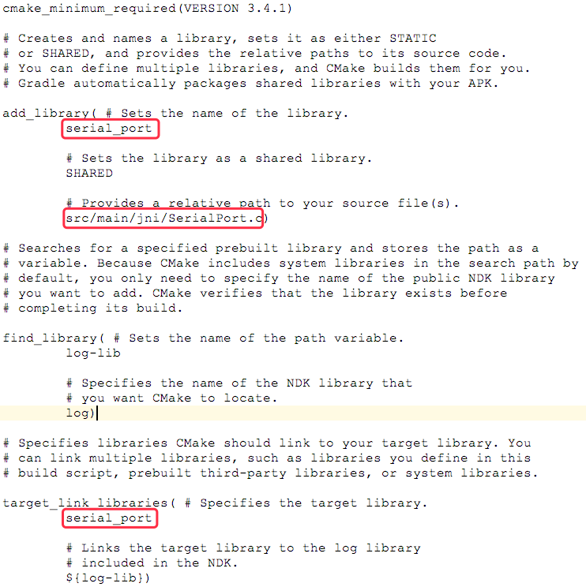

## Android 串口编程

## 目录

* [概述](#概述)
* [打包SO库](#打包SO库)
* [使用SO库](#使用SO库)

## 概述

### 什么是串口?

串行端口 (SerialPort)简称：串口，主要用于数据被逐位按顺序传送的通讯方式称为串口通讯（简单来讲就是按顺序一位一位地传输数据）。

### 串口通信原理

串口通信（Serial Communications）的概念非常简单，串口按位（bit）发送和接收字节。串口用于ASCII码字符的传输。
通信使用3根线完成，分别是地线(GND)、发送(TX)、接收(RX)。由于串口通信是异步的，端口能够在一根线上发送数据同时在另一根线上接收数据。
其他线用于握手，但不是必须的。串口通信最重要的参数是波特率、数据位、停止位和奇偶校验。对于两个进行通信的端口，这些参数必须匹配。

### Android应用串口通信的实现

Android SDK并没有在Framework层实现封装关于串口通信的类库。但是，Android是基于Linux的，所以我们可以像在Linux系统上一样来使用串口。
因为Framework层中并没有封装关于串口通信的类库，所以我们需要通过Android NDK来实现打开、读写串口，然后提供接口供JAVA本地调用。

## 打包SO库

1. 先配置好NDK开发的一些所需工具。在SDK Tools中勾选安装CMake、LLDB、NDK。

2. 创建一个支持"Native C++"项目，项目多了.externalNativeBuild文件夹、cpp文件夹、CMakeLists.txt文件。

  * `.externalNativeBuild文件夹`：cmake编译好的文件，显示支持的各种硬件等信息。
  * `cpp文件夹`：存放C/C++代码文件，native-lib.cpp文件是该Demo中自带的，可更改。
  * `CMakeLists.txt文件`：CMake脚本配置的文件。

3. CMake编译SO文件。

  * 下载android-serialport-api项目

    关于安卓设备上使用串口，谷歌官方有提供代码实例，里面有JNI的代码和串口API的java文件，工程的地址如下：

    Google：https://code.google.com/p/android-serialport-api

    GitHub：https://github.com/cepr/android-serialport-api

  * 将android-serialport-api/project/jni目录下的JNI相关文件SerialPort.h和SerialPort.c复制到jni的目录下。

    这些文件是利用NDK生成SO库的文件，如果不需要修改底层.c文件的源码直接调用，是不需要修改这些文件的。

  * 修改CMakeLists.txt文件

    

    然后编译，在.externalNativeBuild目录下会生成对应的SO库。

## 使用SO库

* 创建jniLibs文件夹，将生成的SO库复制到这个目录。
* 在build.gradle文件中将CMake编译SO文件的相关配置删除，不然SO库重复。

如何使用这个SO库，google官方的例子里面有提供java的API文件。

* 如果没有修改C代码，你的包名必须是`android_serialport_api`。
* 然后将SerialPort.java和SerialPortFinder.java文件复制到目录下。